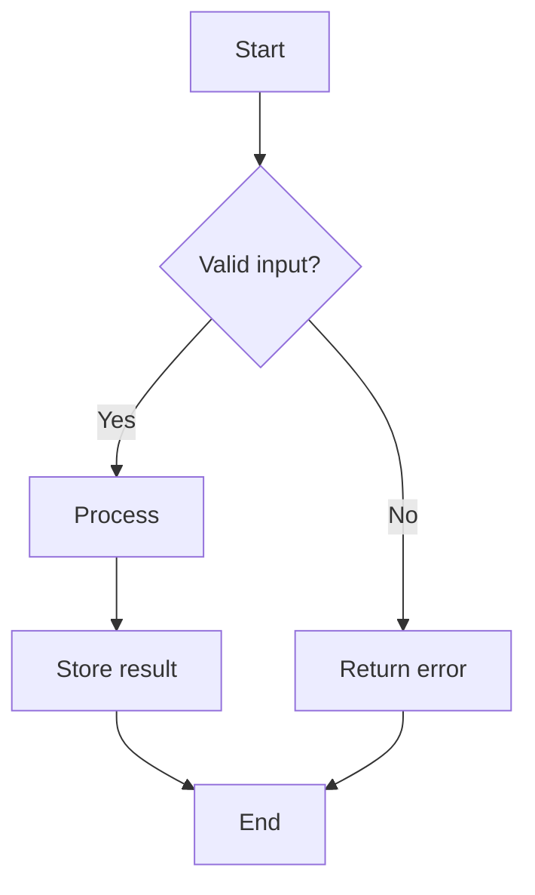
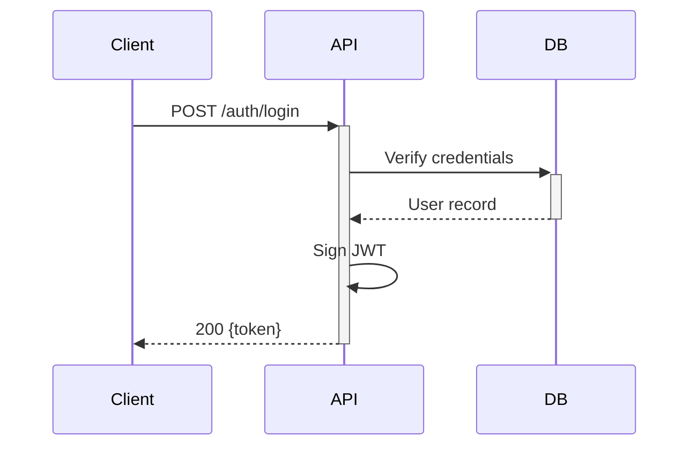
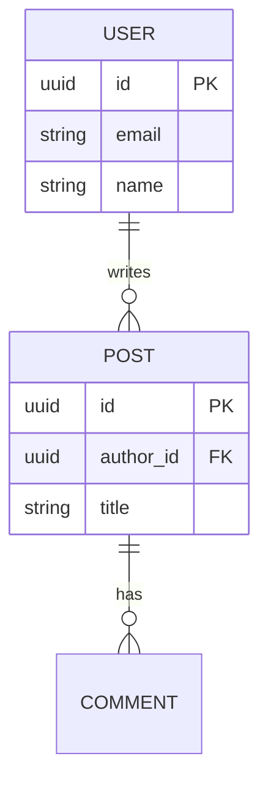
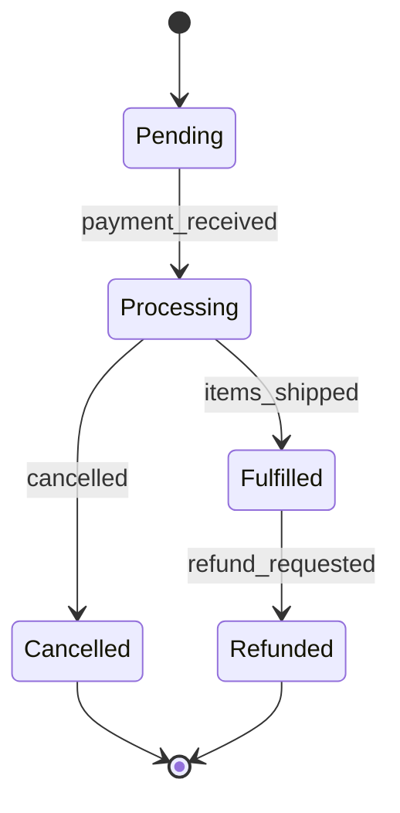

# Diagram Methodology

Guidance for creating technical diagrams that communicate architecture, data flows, and
system behavior clearly. Covers format selection, best practices, and iteration patterns.

## When to use

Consult this skill when:
- Creating architecture diagrams for documentation or ADRs
- Visualizing data flows, API interactions, or service dependencies
- Generating ERDs from database schemas or Prisma models
- Documenting state machines, lifecycles, or authentication flows
- Building dependency graphs from source code imports
- Adding diagrams to README files, runbooks, or technical specs

## Format selection

| Format | Best for | Compatibility |
|---|---|---|
| **Mermaid** | GitHub/GitLab docs, Markdown-embedded diagrams | GitHub, GitLab, Notion, Obsidian |
| **ASCII** | Code comments, terminal output, email | Universal |
| **PlantUML** | Complex enterprise diagrams, detailed UML | PlantUML server, IDE plugins |
| **Draw.io** | Diagrams requiring visual editing or sharing | diagrams.net, Confluence, VS Code |

**Default choice**: Mermaid for documentation-embedded diagrams; ASCII for code comments.

## Diagram type decision tree

```
What are you visualizing?
├─► Process or logic flow    → Flowchart (Mermaid flowchart TD)
├─► Component communication  → Sequence diagram (Mermaid sequenceDiagram)
├─► Object states            → State machine (Mermaid stateDiagram-v2)
├─► Database structure       → ERD (Mermaid erDiagram)
├─► System overview          → Architecture diagram (C4 or Mermaid flowchart)
└─► Code dependencies        → Dependency graph (Mermaid or auto-generated)
```

## Core best practices

- **Max 20 nodes before splitting** — beyond 20 nodes, create an overview diagram plus
  one detail diagram per subsystem.
- **Consistent notation** — the same shape always means the same concept within a diagram
  set; add a legend for any diagram with >5 node types.
- **Left-to-right or top-to-bottom** — pick one direction per diagram; mixing directions
  creates visual confusion.
- **Validate syntax before presenting** — run the Mermaid/PlantUML syntax through a
  renderer; broken diagrams in docs are worse than no diagram.
- **Version diagrams alongside code** — keep diagram source in the same repository as
  the code it describes; stale diagrams are actively misleading.
- **Audience determines detail level** — developer diagrams (data flow, sequence) need
  more detail than stakeholder diagrams (system overview, context).

## Mermaid examples

### Flowchart



### Sequence diagram



### ERD



### State machine



## Iteration protocol

1. **Clarify requirements** before drawing: purpose (documentation, planning, presentation),
   audience (developers, stakeholders), format preference.
2. **Draft overview first** — skeleton with major components; validate scope.
3. **Add detail on confirmation** — fill in parameters, data shapes, error paths.
4. **Offer format conversion** — if the initial format doesn't meet the consumer's tooling,
   convert to the requested format.
5. **Split if complexity grows** — when a diagram exceeds 20 nodes, propose an
   overview + detail split before adding more.

## Done / Acceptance

A diagram is ready when:
- Syntax is valid and renders without errors in the target format
- Node count is ≤20 (or split into overview + detail if larger)
- Shapes and colors are consistent across the diagram set
- A legend is present for diagrams with >5 node types
- The diagram source file is committed to the repository (not image-only)
- The diagram matches the current code or architecture (not a speculative future state
  unless explicitly labeled as such)

## Auto-pick decision tree

| Task context | Recommended format | Diagram class |
|---|---|---|
| ADR or architecture decision | Mermaid | C4 context or flowchart |
| API request/response flow | Mermaid | sequence |
| Database schema / relations | Mermaid | ERD |
| Auth or lifecycle states | Mermaid | state machine |
| Decision logic or branching | Mermaid or ASCII | flowchart |
| System components + boundaries | Mermaid | C4 container |
| Dense cross-reference matrix | ASCII | table |
| Formal UML with annotations | PlantUML | class or component |

**Quick rule:** default to Mermaid unless the consumer explicitly needs PlantUML (formal UML,
enterprise tools) or the diagram is inline text-only context (ASCII). ASCII is reserved for
terminal output or README sections with no Mermaid renderer.

**C4 prerequisite:** C4 diagrams (`c4-context.mmd`, `c4-container.mmd` templates) require the
Mermaid C4 extension (`%%{init: {'theme': 'default'}}%%` or a renderer that bundles `mermaid-c4`).
Verify the target renderer supports C4 before using these templates; fall back to a plain
`flowchart LR` for environments without C4 support.
