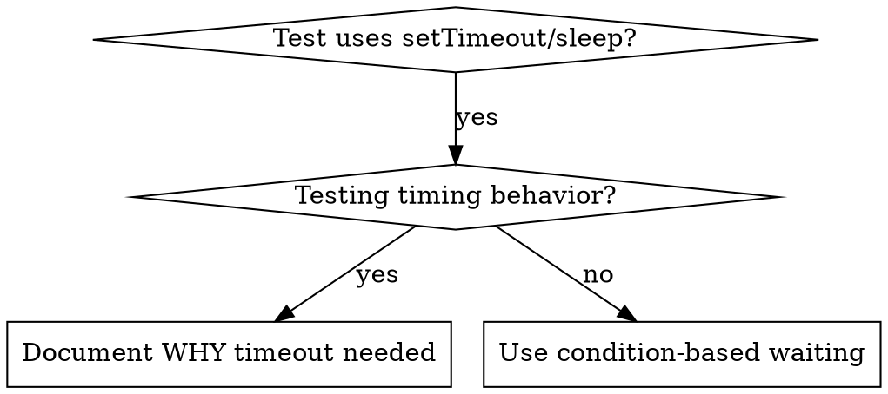

# Flake fixing + defense-in-depth hardening

Two complementary techniques applied AFTER root cause is found. Part 1 prevents timing-based flakes; Part 2 makes the same class of bug structurally impossible going forward.

---

## Part 1: Condition-based waiting (kill timing flakes)

### Overview

Flaky tests often guess at timing with arbitrary delays. This creates race conditions where tests pass on fast machines but fail under load or in CI.

**Core principle:** Wait for the actual condition you care about, not a guess about how long it takes.

### When to use



Use when:
- Tests have arbitrary delays (`setTimeout`, `sleep`, `time.sleep()`).
- Tests are flaky (pass sometimes, fail under load).
- Tests time out when run in parallel.
- Waiting for async operations to complete.

Don't use when:
- Testing actual timing behavior (debounce, throttle intervals).
- Always document WHY if using an arbitrary timeout.

### Core pattern

```typescript
// ❌ BEFORE: Guessing at timing
await new Promise(r => setTimeout(r, 50));
const result = getResult();
expect(result).toBeDefined();

// ✅ AFTER: Waiting for condition
await waitFor(() => getResult() !== undefined);
const result = getResult();
expect(result).toBeDefined();
```

### Quick patterns

| Scenario | Pattern |
|---|---|
| Wait for event | `waitFor(() => events.find(e => e.type === 'DONE'))` |
| Wait for state | `waitFor(() => machine.state === 'ready')` |
| Wait for count | `waitFor(() => items.length >= 5)` |
| Wait for file | `waitFor(() => fs.existsSync(path))` |
| Complex condition | `waitFor(() => obj.ready && obj.value > 10)` |

### Implementation

Generic polling function:

```typescript
async function waitFor<T>(
  condition: () => T | undefined | null | false,
  description: string,
  timeoutMs = 5000
): Promise<T> {
  const startTime = Date.now();

  while (true) {
    const result = condition();
    if (result) return result;

    if (Date.now() - startTime > timeoutMs) {
      throw new Error(`Timeout waiting for ${description} after ${timeoutMs}ms`);
    }

    await new Promise(r => setTimeout(r, 10)); // Poll every 10ms
  }
}
```

See `condition-based-waiting-example.ts` in this directory for the complete implementation with domain-specific helpers (`waitForEvent`, `waitForEventCount`, `waitForEventMatch`) from an actual debugging session.

### Common mistakes

- **❌ Polling too fast:** `setTimeout(check, 1)` — wastes CPU. **✅** Poll every 10ms.
- **❌ No timeout:** loop forever if condition never met. **✅** Always include timeout with clear error.
- **❌ Stale data:** cache state before loop. **✅** Call getter inside loop for fresh data.

### When arbitrary timeout IS correct

```typescript
// Tool ticks every 100ms - need 2 ticks to verify partial output
await waitForEvent(manager, 'TOOL_STARTED'); // First: wait for condition
await new Promise(r => setTimeout(r, 200));   // Then: wait for timed behavior
// 200ms = 2 ticks at 100ms intervals - documented and justified
```

Requirements:
1. First wait for triggering condition.
2. Based on known timing (not guessing).
3. Comment explaining WHY.

### Real-world impact

From a debugging session (2025-10-03):
- Fixed 15 flaky tests across 3 files.
- Pass rate: 60% → 100%.
- Execution time: 40% faster.
- No more race conditions.

---

## Part 2: Defense-in-depth validation

### Overview

When you fix a bug caused by invalid data, adding validation at one place feels sufficient. But that single check can be bypassed by different code paths, refactoring, or mocks.

**Core principle:** Validate at EVERY layer data passes through. Make the bug structurally impossible.

### Why multiple layers

- Single validation: "We fixed the bug."
- Multiple layers: "We made the bug impossible."

Different layers catch different cases:
- Entry validation catches most bugs.
- Business logic catches edge cases.
- Environment guards prevent context-specific dangers.
- Debug logging helps when other layers fail.

### The four layers

#### Layer 1: Entry point validation

Purpose: reject obviously invalid input at the API boundary.

```typescript
function createProject(name: string, workingDirectory: string) {
  if (!workingDirectory || workingDirectory.trim() === '') {
    throw new Error('workingDirectory cannot be empty');
  }
  if (!existsSync(workingDirectory)) {
    throw new Error(`workingDirectory does not exist: ${workingDirectory}`);
  }
  if (!statSync(workingDirectory).isDirectory()) {
    throw new Error(`workingDirectory is not a directory: ${workingDirectory}`);
  }
  // ... proceed
}
```

#### Layer 2: Business logic validation

Purpose: ensure data makes sense for this operation.

```typescript
function initializeWorkspace(projectDir: string, sessionId: string) {
  if (!projectDir) {
    throw new Error('projectDir required for workspace initialization');
  }
  // ... proceed
}
```

#### Layer 3: Environment guards

Purpose: prevent dangerous operations in specific contexts.

```typescript
async function gitInit(directory: string) {
  // In tests, refuse git init outside temp directories
  if (process.env.NODE_ENV === 'test') {
    const normalized = normalize(resolve(directory));
    const tmpDir = normalize(resolve(tmpdir()));

    if (!normalized.startsWith(tmpDir)) {
      throw new Error(
        `Refusing git init outside temp dir during tests: ${directory}`
      );
    }
  }
  // ... proceed
}
```

#### Layer 4: Debug instrumentation

Purpose: capture context for forensics.

```typescript
async function gitInit(directory: string) {
  const stack = new Error().stack;
  logger.debug('About to git init', {
    directory,
    cwd: process.cwd(),
    stack,
  });
  // ... proceed
}
```

### Applying the pattern

When you find a bug:

1. **Trace the data flow** — where does bad value originate? Where used? (see `investigation.md` Part 1).
2. **Map all checkpoints** — list every point data passes through.
3. **Add validation at each layer** — entry, business, environment, debug.
4. **Test each layer** — try to bypass Layer 1; verify Layer 2 catches it.

### Example from session

Bug: empty `projectDir` caused `git init` in source code.

Data flow:
1. Test setup → empty string.
2. `Project.create(name, '')`.
3. `WorkspaceManager.createWorkspace('')`.
4. `git init` runs in `process.cwd()`.

Four layers added:
- Layer 1: `Project.create()` validates not empty / exists / writable.
- Layer 2: `WorkspaceManager` validates projectDir not empty.
- Layer 3: `WorktreeManager` refuses git init outside tmpdir in tests.
- Layer 4: Stack trace logging before git init.

Result: all 1847 tests passed, bug impossible to reproduce.

### Key insight

All four layers were necessary. During testing, each layer caught bugs the others missed:
- Different code paths bypassed entry validation.
- Mocks bypassed business logic checks.
- Edge cases on different platforms needed environment guards.
- Debug logging identified structural misuse.

**Don't stop at one validation point.** Add checks at every layer.
