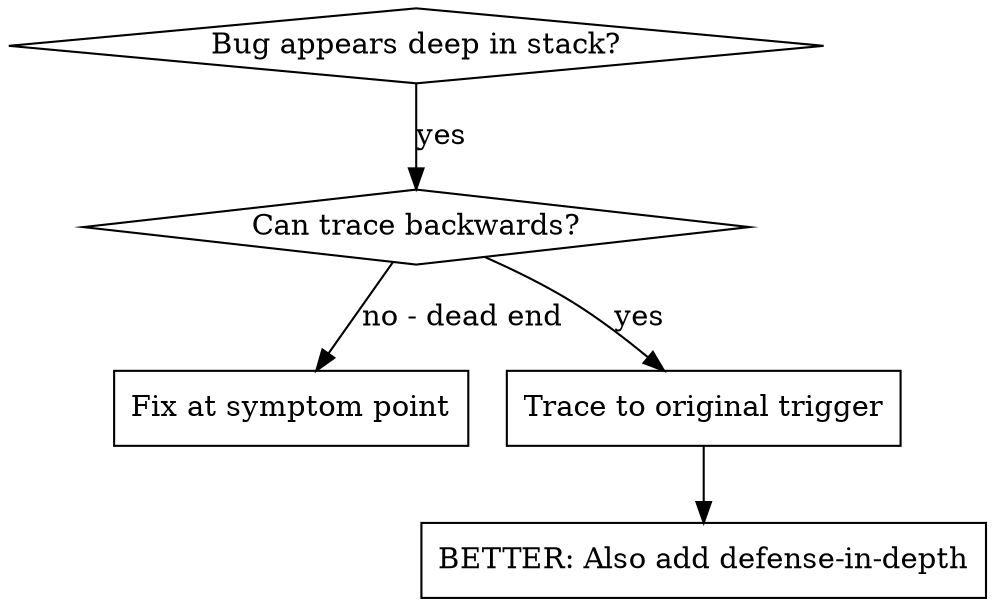
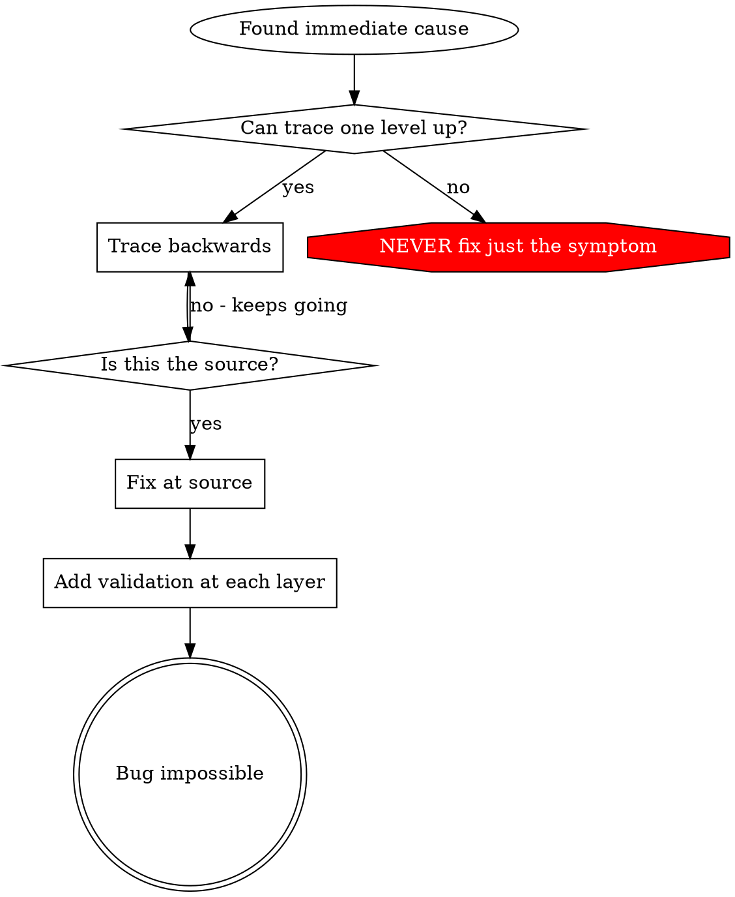

# Investigation techniques

Three complementary techniques for finding root cause, plus the rationalizations to refuse along the way. Load when SKILL.md Phase 1 isn't enough.

---

## Part 1: Backward tracing through the call stack

### Overview

Bugs often manifest deep in the call stack (git init in wrong directory, file created in wrong location, database opened with wrong path). Your instinct is to fix where the error appears, but that's treating a symptom.

**Core principle:** Trace backward through the call chain until you find the original trigger, then fix at the source.

### When to use



Use when:
- Error happens deep in execution (not at entry point).
- Stack trace shows long call chain.
- Unclear where invalid data originated.
- Need to find which test/code triggers the problem.

### The tracing process

#### 1. Observe the symptom
```
Error: git init failed in /Users/jesse/project/packages/core
```

#### 2. Find immediate cause — what code directly causes this?
```typescript
await execFileAsync('git', ['init'], { cwd: projectDir });
```

#### 3. Ask: what called this?
```typescript
WorktreeManager.createSessionWorktree(projectDir, sessionId)
  → called by Session.initializeWorkspace()
  → called by Session.create()
  → called by test at Project.create()
```

#### 4. Keep tracing up — what value was passed?
- `projectDir = ''` (empty string!)
- Empty string as `cwd` resolves to `process.cwd()`
- That's the source code directory!

#### 5. Find original trigger — where did empty string come from?
```typescript
const context = setupCoreTest(); // Returns { tempDir: '' }
Project.create('name', context.tempDir); // Accessed before beforeEach!
```

### Adding stack traces

When you can't trace manually, add instrumentation:

```typescript
async function gitInit(directory: string) {
  const stack = new Error().stack;
  console.error('DEBUG git init:', {
    directory,
    cwd: process.cwd(),
    nodeEnv: process.env.NODE_ENV,
    stack,
  });

  await execFileAsync('git', ['init'], { cwd: directory });
}
```

**Critical:** Use `console.error()` in tests (not logger — may not show).

Run and capture:
```bash
bun test --parallel 2>&1 | grep 'DEBUG git init'
```

Analyze stack traces:
- Look for test file names.
- Find the line number triggering the call.
- Identify the pattern (same test? same parameter?).

### Finding which test causes pollution

If something appears during tests but you don't know which test:

Use the bisection script `find-polluter.sh` in this directory:

```bash
./find-polluter.sh '.git' 'src/**/*.test.ts'
```

Runs tests one-by-one, stops at first polluter. See script for usage.

### Real example: empty projectDir

**Symptom:** `.git` created in `packages/core/` (source code)

**Trace chain:**
1. `git init` runs in `process.cwd()` ← empty cwd parameter
2. WorktreeManager called with empty projectDir
3. Session.create() passed empty string
4. Test accessed `context.tempDir` before beforeEach
5. setupCoreTest() returns `{ tempDir: '' }` initially

**Root cause:** Top-level variable initialization accessing empty value.

**Fix:** Made tempDir a getter that throws if accessed before beforeEach.

**Also added defense-in-depth** (see `flake-and-hardening.md`):
- Layer 1: Project.create() validates directory.
- Layer 2: WorkspaceManager validates not empty.
- Layer 3: NODE_ENV guard refuses git init outside tmpdir.
- Layer 4: Stack trace logging before git init.

### Key principle



**NEVER fix just where the error appears.** Trace back to find the original trigger.

### Stack trace tips

- **In tests:** Use `console.error()` not logger — logger may be suppressed.
- **Before operation:** Log before the dangerous operation, not after it fails.
- **Include context:** Directory, cwd, environment variables, timestamps.
- **Capture stack:** `new Error().stack` shows complete call chain.

---

## Part 2: Git bisect — regression with unknown commit

Use this when a regression surfaces and the introducing commit is unknown. Bisect narrows it to a single commit without manual inspection of full history.

### When to use

- A test that was passing is now failing and you don't know which commit broke it.
- `git log --oneline` shows 5+ commits since the last known-good state.
- The bug is reliably reproducible (or near-reliably — see flaky-tests below).

### Prerequisites

- A failing test (or shell command) that exits 0 = good / nonzero = bad.
- A known-good commit SHA (or tag). If unknown, try `git log --oneline -20` to identify a plausible anchor, or use `HEAD~20` as a pessimistic guess.
- A clean working tree (`git status` should show nothing modified).

### Auto-detect the test command

Before bisecting, resolve the test command to run for each candidate commit.

Priority order (stop at first match):

1. **Package.json `scripts.test`** — read with:
   ```bash
   node -e "const p=require('./package.json');console.log(p.scripts?.test||'')"
   ```
   Accept if non-empty and not the placeholder `"echo \"Error: no test specified\" && exit 1"`.

2. **Bun presence + `bun test`** — if `package.json` exists and step 1 is empty:
   ```bash
   command -v bun && echo "bun test --timeout 30000"
   ```

3. **`npm test`** — fallback when neither resolves.

4. **Explicit override** — if the caller supplies `TEST_CMD` env var, use it directly and skip 1–3.

Store the resolved command in `TEST_CMD`.

### Retry-before-verdict (flaky tests)

A single failing run can be a timing fluke. Before declaring a commit "bad", retry the test command up to `N=3` times. A commit is "bad" only when ALL `N` runs exit nonzero.

```bash
run_with_retry() {
  local cmd="$1"
  local n="${BISECT_RETRIES:-3}"
  for attempt in $(seq 1 "$n"); do
    if eval "$cmd"; then
      return 0   # at least one pass → good commit
    fi
    echo "[bisect] attempt $attempt/$n failed — retrying..."
  done
  return 1       # all attempts failed → bad commit
}
```

### Bisect procedure

#### 1. Start bisect
```bash
git bisect start
git bisect bad                     # current HEAD is broken
git bisect good <KNOWN_GOOD_SHA>   # last known-good commit
```

#### 2. Create the bisect script
```bash
cat > /tmp/bisect-run.sh << 'EOF'
#!/usr/bin/env bash
set -euo pipefail

if [ -z "${TEST_CMD:-}" ]; then
  _pkg_test=$(node -e "try{const p=require('./package.json');const s=p.scripts?.test||'';if(s&&!s.includes('no test specified'))console.log(s)}catch{}" 2>/dev/null || true)
  if [ -n "$_pkg_test" ]; then
    TEST_CMD="$_pkg_test"
  elif command -v bun &>/dev/null && [ -f package.json ]; then
    TEST_CMD="bun test --timeout 30000"
  else
    TEST_CMD="npm test"
  fi
fi

BISECT_RETRIES="${BISECT_RETRIES:-3}"

for attempt in $(seq 1 "$BISECT_RETRIES"); do
  if eval "$TEST_CMD"; then
    exit 0
  fi
  echo "[bisect] attempt $attempt/$BISECT_RETRIES failed"
done
exit 1
EOF
chmod +x /tmp/bisect-run.sh
```

#### 3. Run bisect automatically
```bash
git bisect run /tmp/bisect-run.sh
```

Git will check out a midpoint commit, run the script, record good/bad, repeat until the first bad commit is found.

#### 4. Record the result
```
<sha> is the first bad commit
commit <sha>
Author: ...
Date:   ...
    <commit message>
```

Record this SHA in the fix investigation notes before proceeding.

#### 5. Clean up
```bash
git bisect reset
rm -f /tmp/bisect-run.sh
```

### Interpreting the result

After identifying the introducing commit:

1. `git show <sha>` — read the full diff.
2. Trace which change in that diff is the root cause (Part 1 above).
3. Document: "Regression introduced in `<sha>` by `<specific change>`."
4. Proceed to Phase 3 (Hypothesis) of the main root-cause-discipline flow.

### Edge cases

| Situation | Action |
|---|---|
| No known-good commit | `git log --oneline` to estimate; try a commit before the feature area changed. |
| Bisect finds a merge commit | Check both parents; regression may be in one of the merged branches. |
| Build fails mid-bisect for unrelated reason | `git bisect skip`. Bisect works around skipped commits. |
| Test command itself changes between commits | `git bisect run` with a stable wrapper that re-installs deps each run (`npm ci && $TEST_CMD`). |
| Bisect terminates with "cannot bisect" | History is non-linear; `git bisect log` to inspect, resume manually. |

### Integration with the fix flow

This is the canonical path for the "regression, unknown commit" case. After bisect:

- Introducing commit SHA goes into the fix handoff Risks as `root-cause-commit: <sha>`.
- Test that bisect ran becomes the failing reproducer for Phase 4 TDD.
- No fix attempted until root cause within that commit is identified (Part 1).

---

## Part 3: Anti-patterns and partner signals

### Common rationalizations (refuse these)

| Excuse | Reality |
|---|---|
| "Issue is simple, don't need process" | Simple issues have root causes too. Process is fast for simple bugs. |
| "Emergency, no time for process" | Systematic debugging is FASTER than guess-and-check thrashing. |
| "Just try this first, then investigate" | First fix sets the pattern. Do it right from the start. |
| "I'll write test after confirming fix works" | Untested fixes don't stick. Test first proves it. |
| "Multiple fixes at once saves time" | Can't isolate what worked. Causes new bugs. |
| "Reference too long, I'll adapt the pattern" | Partial understanding guarantees bugs. Read it completely. |
| "I see the problem, let me fix it" | Seeing symptoms ≠ understanding root cause. |
| "One more fix attempt" (after 2+ failures) | 3+ failures = architectural problem. Question pattern, don't fix again. |

### Partner signals you're doing it wrong

Watch for these redirections from your human partner:

- "Is that not happening?" — You assumed without verifying.
- "Will it show us...?" — You should have added evidence gathering.
- "Stop guessing" — You're proposing fixes without understanding.
- "Ultrathink this" — Question fundamentals, not just symptoms.
- "We're stuck?" (frustrated) — Your approach isn't working.

When you see these: STOP. Return to Phase 1.

---

## Real-world impact

From a debugging session (2025-10-03):
- Found root cause through 5-level trace.
- Fixed at source (getter validation).
- Added 4 layers of defense (see `flake-and-hardening.md`).
- 1847 tests passed, zero pollution.
